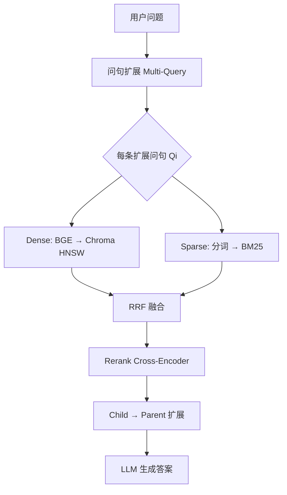

# Hybrid 检索详解

> 本文档基于 **3DocPulse-RAG** 项目源码，系统说明 Hybrid（混合）检索的两条通路——**Dense 稠密向量检索**与 **Sparse 稀疏 BM25 检索**——的索引构建、在线查询流程、核心计算公式，以及 RRF 融合与完整流水线。  
> 对应代码：`src/docpulse/retrieval/engine.py`、`indexer.py`、`embeddings.py`、`chroma_store.py`、`hybrid.py`、`query_rewrite.py`。

---

## 目录

1. [什么是 Hybrid 检索](#1-什么是-hybrid-检索)
2. [整体架构与数据流](#2-整体架构与数据流)
3. [检索单元：Parent-Child 分块](#3-检索单元parent-child-分块)
4. [Dense 稠密检索（BGE + Chroma HNSW）](#4-dense-稠密检索bge--chroma-hnsw)（含 [HNSW 建图详解](#46-hnsw-建图详解)）
5. [Sparse 稀疏检索（BM25）](#5-sparse-稀疏检索bm25)
6. [问句扩展 Multi-Query](#6-问句扩展-multi-query)
7. [RRF 融合](#7-rrf-融合)
8. [完整在线查询流水线](#8-完整在线查询流水线)
9. [配置参数一览](#9-配置参数一览)
10. [源码文件对照表](#10-源码文件对照表)
11. [Dense vs Sparse vs 暴力检索对比](#11-dense-vs-sparse-vs-暴力检索对比)
12. [附录：如何窥探 bm25.pkl](#附录如何窥探-bm25pkl)

---

## 1. 什么是 Hybrid 检索

在本项目中，**Hybrid 检索**指同时启用两条互补的召回通路：

| 通路 | 方法 | 存储 | 擅长 |
|------|------|------|------|
| **Dense（稠密）** | BGE 向量 + 余弦相似度 | Chroma（HNSW 图索引） | 语义相近（说法不同、意思相同） |
| **Sparse（稀疏）** | BM25 关键词匹配 | `bm25.pkl`（内存词频 + IDF） | 精确字面匹配（API 名、类名、参数名） |

两路各自召回 top-K 的 **child chunk**，再通过 **RRF（Reciprocal Rank Fusion）** 按排名融合，**不直接混合两种分数的量纲**。

开关：`use_hybrid=True`（默认开启）；CLI 可用 `--no-hybrid` 关闭 BM25，仅保留向量检索。

---

## 2. 整体架构与数据流

### 2.1 离线建索引（`python -m docpulse index`）

```
Markdown 文档
    ↓  ingest + chunk
data/state/<project>/chunks.jsonl   （parent + child 元数据与正文）
    ↓  index
    ├─→ Chroma: child 向量 + metadata + HNSW 图
    └─→ bm25.pkl: chunk_ids + BM25Okapi 对象
```

### 2.2 在线查询（Hybrid 召回阶段）

```
用户问题
    ↓
问句扩展 rule_expand_queries → [Q1, Q2, Q3, ...]
    ↓
对每条扩展问句 Qi：
    ├─ Dense:  BGE 编码 → Chroma HNSW → top dense_k (50)
    └─ Sparse: 分词 → BM25 get_scores → top sparse_k (50)
    ↓
RRF 融合所有排名列表 → top rrf_k (60) 候选 child_id
    ↓
Cross-Encoder 精排（原始问句）→ top rerank_k (8)
    ↓
Child → Parent 扩展 → 送 LLM 生成答案
```

> **注意**：Cross-Encoder Rerank 不属于 Hybrid 本身，但是检索流水线的下一步；Hybrid 只负责「粗召回 + RRF 融合」。

---

## 3. 检索单元：Parent-Child 分块

索引与检索**只针对 child**，命中后回溯 **parent** 全文给 LLM。

```
文档
 └── Parent（一个 ##/### 章节，较长）
       └── Child 1, Child 2, ...（章节内小块，较短）
```

| 层级 | 写入 Chroma | 写入 BM25 | 用途 |
|------|-------------|-----------|------|
| child | ✅ | ✅ | 检索定位 |
| parent | ❌ | ❌ | 命中 child 后取整章上下文 |

设计动机：**Child 短、语义集中 → 检索准；Parent 长、内容完整 → 生成答案上下文足。**

---

## 4. Dense 稠密检索（BGE + Chroma HNSW）

### 4.1 索引构建流程

**入口**：`src/docpulse/ingest/indexer.py` → `index_project()`

```
1. 从 chunks.jsonl 加载全部块
2. 筛选 level=child 且 is_active=True
3. 批量 embed_texts(child.text)  → 384 维浮点向量（L2 归一化）
4. Chroma upsert：
     id        = chunk_id
     embedding = 向量
     document  = child 正文
     metadata  = project, parent_id, file_path, heading_path, ...
5. Chroma 底层 hnswlib 自动构建 HNSW 多层近邻图（cosine 空间）
```

**Embedding 模型**（`config.yaml`）：

```yaml
embedding:
  model: BAAI/bge-small-en-v1.5
  device: auto
```

**加载方式**：`sentence_transformers.SentenceTransformer`（工具库），模型权重为 BGE。

**关键代码**（`embeddings.py`）：

```python
vectors = model.encode(
    texts,
    normalize_embeddings=True,  # L2 归一化
)
```

**Chroma 配置**（`chroma_store.py`）：

```python
metadata={"hnsw:space": "cosine"}
```

**持久化路径**：`data/state/chroma/`（collection 名：`docpulse_chunks`）

---

### 4.2 Dense 索引里存什么

每个 child 在 Chroma 中对应一条记录：

```
{
  id:         "443969bb1607924e1a368f39"     # chunk_id
  embedding:  [0.012, -0.034, ..., 0.008]    # 384 维向量
  document:   "## APIRouter\nUse `APIRouter` ..."
  metadata: {
    project: "fastapi",
    parent_id: "...",
    level: "child",
    is_active: true,
  }
}
```

外加 HNSW 图结构（节点 = 向量，边 = 近邻关系，由 hnswlib 维护，不直接暴露给用户）。

---

### 4.3 在线查询流程

**入口**：`engine._dense_search()` → `embed_texts([query])` → `chroma_store.query_dense()`

```
Step 1: 问句 → BGE.encode(normalize=True) → query_vector (384 维)

Step 2: Chroma collection.query(
          query_embeddings=[query_vector],
          n_results=dense_k,          # 默认 50
          where={ project, level=child, is_active=true }
        )

Step 3: HNSW 近似最近邻搜索（非暴力全扫）
        返回 cosine distance 列表

Step 4: similarity = 1 - distance
        返回 [(chunk_id, similarity), ...]
```

---

### 4.4 相似度计算公式

#### 余弦相似度（Cosine Similarity）

向量 \(\mathbf{q}\)（问句）与 \(\mathbf{d}\)（文档）：

\[
\text{sim}(\mathbf{q}, \mathbf{d}) = \frac{\mathbf{q} \cdot \mathbf{d}}{\|\mathbf{q}\| \|\mathbf{d}\|}
\]

本项目对入库向量与 query 向量均做 **L2 归一化**（\(\|\mathbf{q}\| = \|\mathbf{d}\| = 1\)），因此：

\[
\text{sim}(\mathbf{q}, \mathbf{d}) = \mathbf{q} \cdot \mathbf{d}
\]

#### 余弦距离（Chroma 返回）

\[
\text{cosine\_distance}(\mathbf{q}, \mathbf{d}) = 1 - \text{sim}(\mathbf{q}, \mathbf{d})
\]

代码转换：

```python
similarity = 1.0 - float(distance)
```

| distance | similarity | 含义 |
|----------|------------|------|
| 0 | 1 | 完全相同方向 |
| 1 | 0 | 正交 |
| 2 | -1 | 完全相反 |

---

### 4.5 HNSW 近似最近邻（vs 暴力）

#### 暴力检索（你之前可能的做法）

```python
for each doc_vector in all_vectors:      # O(N)
    sim = dot(query_vec, doc_vector)     # O(D)，D=384
sort by sim, take top K
```

- **复杂度**：O(N × D)
- **结果**：精确 top-K
- **问题**：N 到百万级时极慢

#### HNSW 概述

**HNSW** = Hierarchical Navigable Small World（分层可导航小世界图）

Chroma 在你 `upsert` 向量时，底层 **hnswlib** 自动建图；**不是换一种相似度**，而是 **换一种搜索路径**——距离定义仍是 cosine，与暴力一致。

| 维度 | 暴力 | HNSW |
|------|------|------|
| 建索引 | 几乎不用（向量堆在一起） | 逐个插入、连边，稍慢 |
| 查询 | O(N × D) 全扫 | O(log N × M) 沿图导航 |
| 结果 | 精确 top-K | 近似 top-K（通常≈精确） |

**关键 HNSW 参数**（Chroma 可配，本项目用默认）：

| 参数 | 阶段 | 含义 |
|------|------|------|
| M | 建图 + 查询 | 每节点最大邻居数，越大召回越好、内存越大 |
| ef_construction | 建图 | 插入时局部搜索宽度，越大图质量越好、入库越慢 |
| ef_search | 查询 | 搜索时候选集大小，越大越接近暴力精度 |

---

### 4.6 HNSW 建图详解

本节说明 hnswlib 在 `python -m docpulse index` 写入 Chroma 时，**如何把 3699 个 child 向量建成多层近邻图**。

#### 4.6.1 多层图长什么样

把每个 child 向量想象成一个「城市」，query 向量是要找的目标。HNSW 事先修好多层公路网：

```
Layer 2（顶层，节点很少，边很长 —— 全国高铁）
    A ───────────────── D

Layer 1（中层）
    A ─── B ─── D
         │     │
         C ─── E

Layer 0（底层，所有节点都在，边较短 —— 市内街道）
    A─B─C─D─E─F─G─H─...（全部 N 个点，如 3699 个）
```

| 层 | 节点 | 作用 |
|----|------|------|
| Layer 0 | **全部** child 向量 | 精细搜索，保证每个点都在 |
| Layer 1+ | **随机子集** 升层 | 长距离跳跃，快速逼近目标区域 |

#### 4.6.2 哪些点在哪些层？（随机升层）

- **Layer 0**：**100% 的点都在**，没有随机。
- **Layer 1、2、3…**：每个点在 **插入时随机决定** 最高能到第几层。

插入新向量 v 时，用指数分布随机抽最高层号 l（类似反复抛硬币）：

```
l = 0          ← 一定在 Layer 0
抛硬币，约 50% 停 → 只在 Layer 0
约 50% 继续 → l = 1，再抛…
```

典型结果：

| 层 | 大约占比 | 说明 |
|----|----------|------|
| Layer 0 | 100% | 全部 N 个点 |
| Layer 1 | ~50% | 随机升层 |
| Layer 2 | ~25% | 随机升层 |
| Layer 3 | ~12.5% | 越来越少 |

**要点**：

1. **随机的是「升几层」**，不是「连谁当邻居」——邻居按 **距离最近** 选。
2. 升层 **只在插入那一刻随机一次**，建图完成后结构固定，查询时不再随机。
3. **不是**按「谁更重要、谁更中心」选上层点，这样对插入顺序不敏感，图更稳定。

#### 4.6.3 建图 = 逐个插入向量

`indexer.py` 批量 `upsert` 时，hnswlib 在后台 **逐个**（或分批）把向量插进图。每插入一个新向量 **X**，流程如下：

**Step 1：随机决定 X 出现在哪几层**

例如 X 抽到最高层 l=2，则 X 会出现在 Layer 0、1、2。

**Step 2：从顶层入口贪心导航**

从当前图 **最高层** 的 **入口点**（entry point）出发，在每一层做 **贪心搜索**：

```
在 Layer 2：
  看当前点邻居里谁离 X 最近 → 走过去
  再看新位置邻居里谁离 X 最近 → 再走过去
  ……直到「再走就不更近了」
```

**Step 3：逐层下降到 Layer 0**

```
Layer 2 找到大致区域 → 落到 Layer 1 同位置附近
Layer 1 继续贪心细化   → 落到 Layer 0
Layer 0 在局部扩展，收集 ef_construction 个最近候选
```

**Step 4：连边 —— 每个点最多连 M 个邻居**

在 X 所在的每一层，从候选中选出离 X **最近的 M 个**（默认 M≈16），建立 **双向边**：

```
        X
       /|\
      / | \
   n1  n2  n3  ...  (最多 M 个邻居)
```

若某个老节点邻居超过 M 个，会 **删掉最远的边**，保持度数上限。

#### 4.6.4 插入示例（3 个已有节点 + 新点 X）

Layer 0 已有 A、B、C、D、E（数字表示与 X 的距离）：

```
已有: A(远)  B(中)  C(近)  D(很近)  E(中)
新插入: X
```

1. 从入口 A 出发，邻居里谁离 X 最近 → 跳到 D  
2. 在 D 的邻居里继续贪心 → 停在 D 附近  
3. Layer 0 扩展搜索，收集 ef_construction 个候选，如 `{C, D, E, F, G}`  
4. 选离 X 最近的 M=3 个：`C, D, E`  
5. 连边：`X ↔ C`, `X ↔ D`, `X ↔ E`

3699 个 child 重复上述过程，最终形成持久化在 `data/state/chroma/` 的多层图。

#### 4.6.5 两个关键参数在建图中的作用

**M（每点最多邻居数）**

```
M=4  稀疏:  A─B  C─D     跳远要绕路
M=16 较密:  A─B─C─D─E    更容易一步跳到好区域
```

**ef_construction（建图时局部搜索宽度）**

插入 X 时，在 Layer 0 不只找最近的 1 个，而是先收集 **ef_construction 个**（如 100 个）候选，再从中挑 M 个连边。

| ef_construction | 效果 |
|-----------------|------|
| 大 | 边连得更准，索引质量高，**入库更慢** |
| 小 | 建得快，图质量可能差，查询召回下降 |

#### 4.6.6 建图 vs 查询（别混了）

| | **建图（insert / upsert）** | **查询（query）** |
|---|---|---|
| 触发时机 | `python -m docpulse index` | 用户提问 `_dense_search()` |
| 目的 | 把新向量插进图，连好边 | 找离 query 最近的 K 个 |
| 过程 | 随机定层 → 贪心导航 → 选 M 个最近邻连边 | 从顶层贪心导航 → Layer 0 扩展 ef_search 个候选 → 精确算 cosine → top K |
| 关键参数 | `M`, `ef_construction` | `M`, `ef_search` |

**建图慢一次，查询快很多次**——与 BM25「离线建 `bm25.pkl`、在线 `get_scores`」是同一思路。

#### 4.6.7 查询流程（在线）

用户提问时，HNSW **不再建图**，只在已有图上导航：

```
1. 问句 → BGE 编码 → query_vector
2. 从顶层入口贪心找离 query 最近的节点（高速公路）
3. 逐层下降，继续贪心导航
4. 在 Layer 0 局部扩展，收集 ef_search 个候选
5. 对候选精确算 cosine distance
6. similarity = 1 - distance，返回 top dense_k (50)
```

与暴力的关系：

```
暴力:
  for 每个向量 v:
      sim = cosine(query, v)
  sort → top K

HNSW:
  沿多层图贪心走到 query 附近
  只对 ef_search 个候选算 cosine
  sort → top K（近似）
```

#### 4.6.8 与本项目的对应

```python
# chroma_store.py — 指定 cosine 空间；建图由 Chroma/hnswlib 自动完成
metadata={"hnsw:space": "cosine"}
```

| 阶段 | 项目中的动作 | HNSW 在做什么 |
|------|--------------|---------------|
| 建索引 | `store.upsert_children(batch_c, batch_v)` | 逐个插入向量，随机升层 + 连 M 条边 |
| 持久化 | 写入 `data/state/chroma/` | 图结构与向量一并落盘 |
| 查询 | `collection.query(query_embeddings=..., n_results=50)` | 沿图导航，返回近似最近邻 |

**一句话**：HNSW 建图 = 每个向量插入时，在多层图上贪心找到「该待的位置」，再与周围最相似的 M 个向量连边；Layer 0 全员在，更高层随机升层用于长跳；查询时沿同一张图导航，不必与全部 N 个向量暴力比对。

---

## 5. Sparse 稀疏检索（BM25）

### 5.1 索引构建流程

**入口**：`indexer.build_bm25()`

```
1. 对每个 child.text 分词 _tokenize()
2. 得到 corpus_tokens = [ [词列表], [词列表], ... ]
3. BM25Okapi(corpus_tokens) 在内存建统计结构
4. pickle 保存：
     {
       "chunk_ids": [chunk_id_0, chunk_id_1, ...],
       "bm25": <BM25Okapi 对象>
     }
```

**持久化路径**：`data/state/<project>/bm25.pkl`（二进制，不可用文本编辑器直接打开）

**分词规则**（建索引与查询必须一致）：

```python
TOKEN_RE = re.compile(r"[a-zA-Z0-9_]+")

def _tokenize(text):
    return [t.lower() for t in TOKEN_RE.findall(text)]
```

示例：

```
原文: "## APIRouter\nUse `APIRouter` for routing."
分词: ["apirouter", "use", "apirouter", "for", "routing"]
```

特点：
- CamelCase **不拆分**（`APIRouter` → `apirouter`）
- 中文基本无法匹配（正则只覆盖英文/数字）
- 适合 FastAPI 英文技术文档

---

### 5.2 BM25 索引内部结构

`bm25.pkl` 解压后（概念结构，非可读文件）：

```
{
  chunk_ids: ["c1", "c2", ..., "c3699"],

  bm25: BM25Okapi {
    corpus_size: 3699,           # child 总数 N
    avgdl: 48.83,                # 平均文档长度（token 数）
    doc_len: [49, 32, 61, ...],  # 每篇 child 的 token 数

    doc_freqs: [                 # 3699 张词频表
      { "apirouter": 1, "use": 2, "fastapi": 2, ... },  # child 0
      { "install": 1, "pip": 1, ... },                   # child 1
      ...
    ],

    idf: {                      # 全局词表，每个词一个 IDF
      "apirouter": 4.4085,       # 出现在 44/3699 篇 → 稀有 → 高权重
      "the": 1.7593,             # 常见词 → 低权重
      "in": 0.3847,
      ...                        # 约 8000+ 个不同词
    },

    k1: 1.5,                     # 词频饱和度（默认）
    b: 0.75,                     # 长度归一化（默认）
    epsilon: 0.25               # IDF 下限（BM25Okapi 特有）
  }
}
```

**对应关系**：

```
下标 i  ↔  chunk_ids[i]  ↔  doc_freqs[i]  ↔  doc_len[i]
```

**不存储原文**：child 正文在 `chunks.jsonl` 和 Chroma 的 `document` 字段中。

---

### 5.3 建索引时算什么、查询时算什么

| 阶段 | 操作 | 频率 |
|------|------|------|
| **建索引** | 每篇 child 统计词频 → `doc_freqs[i]` | 每 child 一次 |
| **建索引** | 每个词的全局 IDF | 每个词 **全库只算 1 次** |
| **查询** | 问句分词 | 每个 query 一次 |
| **查询** | 每个 query 词 × 每篇 child 算 BM25 分 | 暴力扫全库 |

`rank_bm25.get_scores()` 对 **全部 N 篇 child** 返回分数数组，再排序取 top-K。

---

### 5.4 在线查询流程

**入口**：`engine._sparse_search()`

```
Step 1: pickle.load(bm25.pkl) → chunk_ids, bm25

Step 2: 问句分词（与建索引同一 TOKEN_RE）
        "How does APIRouter work?" → ["how", "does", "apirouter", "work"]

Step 3: scores = bm25.get_scores(tokens)
        返回长度 = corpus_size 的数组，scores[i] = 第 i 篇 child 的 BM25 分

Step 4: zip(chunk_ids, scores) 按分降序 → 取 top sparse_k (50)

Step 5: 过滤 score > 0（无匹配词的不返回噪声）
```

---

### 5.5 BM25 打分公式（BM25Okapi 变体）

本项目使用 `rank_bm25.BM25Okapi`，默认参数 `k1=1.5, b=0.75, epsilon=0.25`。

对问句中每个词 \(q\)，累加到文档 \(d\) 的分数：

\[
\text{score}(d, Q) = \sum_{q \in Q} \text{IDF}(q) \cdot \frac{f(q,d) \cdot (k_1 + 1)}{f(q,d) + k_1 \cdot \left(1 - b + b \cdot \frac{|d|}{\text{avgdl}}\right)}
\]

其中：

| 符号 | 含义 |
|------|------|
| \(Q\) | 问句分词后的词集合 |
| \(f(q,d)\) | 词 \(q\) 在文档 \(d\) 中出现次数（TF） |
| \(|d|\) | 文档 \(d\) 的 token 总数 |
| avgdl | 全库 child 平均 token 数 |
| \(k_1\) | 词频饱和度：越大，重复出现加分越多 |
| \(b\) | 长度归一化：越大，长文档越「吃亏」 |
| IDF(q) | 逆文档频率，衡量词稀有度 |

#### IDF 计算（BM25Okapi / ATIRE 变体）

\[
\text{IDF}(q) = \log \frac{N - n_q + 0.5}{n_q + 0.5}
\]

- \(N\) = 文档总数（child 数）
- \(n_q\) = 包含词 \(q\) 的文档数

若 IDF 为负（词出现在超过半数文档中），抬到下限：

\[
\text{IDF}_{\text{floor}}(q) = \epsilon \times \text{average\_idf}, \quad \epsilon = 0.25
\]

#### 参数直觉

| 参数 | 默认值 | 作用 |
|------|--------|------|
| k1 | 1.5 | 词出现 2 次比 1 次加分，但很快饱和 |
| b | 0.75 | 防止长 child 因词多而虚高 |
| epsilon | 0.25 | 常见词（the, in）不给负分，但权重极低 |

#### 代码实现位置

打分公式在第三方库 `rank_bm25.py` 的 `BM25Okapi.get_scores()` 中；本项目只调用：

```python
scores = bm25.get_scores(tokens)
```

---

## 6. 问句扩展 Multi-Query

Hybrid 召回**之前**，可选做问句扩展（`use_rewrite=True`）。

**入口**：`query_rewrite.rule_expand_queries()`

从原问中提取：
- 反引号标识符 `` `APIRouter` ``
- CamelCase / snake_case 术语
- 英文关键词子串

返回：`[原问 + 最多 rule_expansions 条扩展]`（默认 `rule_expansions: 2`）

示例：

```
输入: "How does FastAPI handle APIRouter?"
输出: [
  "How does FastAPI handle APIRouter?",
  "APIRouter",
  "Fast API"
]
```

**每条扩展问句都会分别走 Dense + Sparse 两路**，扩大召回面。

> 精排 Rerank 使用**原始用户问句**，不用扩展问句。

---

## 7. RRF 融合

### 7.1 为什么需要 RRF

Dense 返回的是 **0~1 相似度**，BM25 返回的是 **无界 BM25 分**，量纲完全不同，不能直接加权平均。

**RRF（Reciprocal Rank Fusion）** 只依赖**排名**，不依赖原始分数。

### 7.2 公式

对文档 \(d\)，在多条排名列表中的 RRF 分：

\[
\text{RRF}(d) = \sum_{i=1}^{L} \frac{1}{k + \text{rank}_i(d) + 1}
\]

- \(L\) = 排名列表条数（扩展问句数 × 2，若 Hybrid 开启）
- \(\text{rank}_i(d)\) = 文档 \(d\) 在第 \(i\) 路检索中的名次（**从 0 起**）
- \(k\) = 平滑常数，本项目默认 **60**（`config.yaml` → `rrf_k: 60`）

同一 child 在越多路检索里排名靠前，RRF 分越高（多路共识加分）。

### 7.3 示例

某 child 在 Dense 路排第 0，BM25 路排第 2，\(k=60\)：

\[
\text{RRF} = \frac{1}{60+0+1} + \frac{1}{60+2+1} = \frac{1}{61} + \frac{1}{63} \approx 0.0164 + 0.0159 = 0.0323
\]

### 7.4 代码

```python
# hybrid.py
scores[doc_id] += 1.0 / (rrf_k + rank + 1)
```

输入：`dense_lists + sparse_lists`（每条是一个 chunk_id 排名列表）  
输出：top `rrf_k`（60）个候选 child_id

---

## 8. 完整在线查询流水线

以默认配置、Hybrid 全开为例：

```
用户: "How does APIRouter work?"

① 问句扩展
   → ["How does APIRouter work?", "APIRouter", "Fast API"]  (3 条)

② 每路问句 × 两通路召回
   Dense: 3 × top 50 = 3 条排名列表
   Sparse: 3 × top 50 = 3 条排名列表
   共 6 条列表输入 RRF

③ RRF 融合
   → top 60 候选 child_id

④ 从 Chroma 批量取 candidate 的 text + metadata

⑤ Cross-Encoder 精排（bge-reranker-base，原始问句）
   → top 8 child

⑥ Child → Parent 扩展，按 parent_id 去重
   → 最多 final_parent_n (4) 个 parent 全文

⑦ 拼接 context → DeepSeek LLM 生成答案
```

**Mermaid 流程图**：



---

## 9. 配置参数一览

`config.yaml` → `retrieval` 段：

| 参数 | 默认值 | 含义 |
|------|--------|------|
| `dense_k` | 50 | 每路 Dense 召回 child 数 |
| `sparse_k` | 50 | 每路 BM25 召回 child 数 |
| `rrf_k` | 60 | RRF 融合后保留候选数 |
| `rerank_k` | 8 | Cross-Encoder 精排后保留数 |
| `final_parent_n` | 4 | 最终送 LLM 的 parent 数 |

`query_rewrite`：

| 参数 | 默认值 | 含义 |
|------|--------|------|
| `rule_expansions` | 2 | 规则扩展问句条数（不含原问） |

---

## 10. 源码文件对照表

| 阶段 | 文件 | 关键函数 |
|------|------|----------|
| 索引构建 | `ingest/indexer.py` | `index_project()`, `build_bm25()` |
| 向量编码 | `embeddings.py` | `embed_texts()`, `get_embedding_model()` |
| 向量存储 | `vectorstore/chroma_store.py` | `upsert_children()`, `query_dense()` |
| Dense 检索 | `retrieval/engine.py` | `_dense_search()` |
| Sparse 检索 | `retrieval/engine.py` | `_sparse_search()`, `_load_bm25()` |
| 问句扩展 | `retrieval/query_rewrite.py` | `rule_expand_queries()` |
| RRF 融合 | `retrieval/hybrid.py` | `rrf_fuse()` |
| 精排 | `retrieval/rerank.py` | `rerank_pairs()` |
| 编排入口 | `retrieval/engine.py` | `retrieve_contexts()` |

---

## 11. Dense vs Sparse vs 暴力检索对比

| 维度 | Dense（HNSW） | Sparse（BM25） | 暴力向量（对比参考） |
|------|---------------|----------------|---------------------|
| 索引内容 | 384 维 float 向量 + HNSW 图 | 词频表 + IDF 字典 | 向量数组 |
| 存储位置 | `data/state/chroma/` | `data/state/<project>/bm25.pkl` | 内存/文件 |
| 相似度/分数 | 余弦相似度（1 - distance） | BM25 分 | 精确余弦相似度 |
| 查询复杂度 | O(log N) 近似 | O(N × \|Q\|) 全扫 | O(N × D) 全扫 |
| 擅长 | 语义相近 | 精确关键词 | 语义（精确） |
| 不擅长 | 罕见专有名词 | 同义词、换说法 | 大规模延迟 |
| 中文 | BGE 有一定语义能力 | 当前分词几乎不支持 | 取决于模型 |

**Hybrid 的价值**：Dense 召回「意思像的」，Sparse 召回「词像的」，RRF 合并后两者互补。

---

## 12. 附录：如何窥探 bm25.pkl

`bm25.pkl` 是二进制 pickle，不可用编辑器直接阅读。用 Python 加载：

```python
import pickle
from pathlib import Path

path = Path("data/state/fastapi/bm25.pkl")
data = pickle.load(path.open("rb"))

print("keys:", data.keys())
print("child 数量:", len(data["chunk_ids"]))

bm25 = data["bm25"]
print("corpus_size:", bm25.corpus_size)
print("avgdl:", bm25.avgdl)
print("k1, b, epsilon:", bm25.k1, bm25.b, bm25.epsilon)
print("词表大小:", len(bm25.idf))
print("样例 IDF:", list(bm25.idf.items())[:10])
```

模拟查询：

```python
from docpulse.ingest.indexer import _tokenize

query = _tokenize("How does APIRouter work?")
scores = bm25.get_scores(query)
top = sorted(zip(data["chunk_ids"], scores), key=lambda x: -x[1])[:5]
print([(cid, round(s, 3)) for cid, s in top if s > 0])
```

---

## 13. 相关命令

```bash
# 建索引（向量 + BM25）
python -m docpulse index

# 全量重建 Chroma collection
python -m docpulse index --recreate

# 问答（默认 Hybrid 开启）
python -m docpulse ask "How does APIRouter work?"

# 关闭 BM25，仅向量检索
python -m docpulse ask "..." --no-hybrid
```

---

*文档版本：与 3DocPulse-RAG 源码同步，涵盖 M2 阶段 Hybrid 检索实现。*
