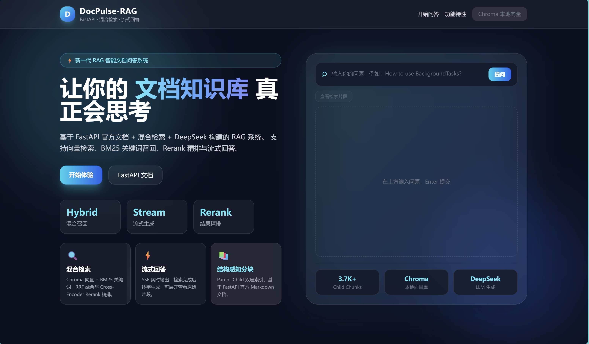

# DocPulse-RAG



基于 FastAPI 官方英文文档的本地 RAG 问答项目：结构感知分块、Chroma 向量检索、BM25 混合召回、交叉编码器重排，以及 DeepSeek 流式回答。Web 页面由 FastAPI 提供，数据与索引保存在本机。

## 功能与状态

| 功能 | 状态 |
| --- | --- |
| Git/本地文档入库、Parent-Child 分块与文件指纹 | 已实现 |
| Chroma + BM25 混合检索、RRF 融合与重排 | 已实现 |
| 命令行问答与 Web SSE 流式回答 | 已实现 |
| 向量索引增量更新、LLM 查询改写、自动评测 | 规划中 |

## 环境准备

- Python 3.9+；自动拉取 FastAPI 文档时需要 Git。
- 可用的 DeepSeek API Key。密钥仅写入本机 `.env`，不要提交。
- 首次建立索引和首次重排会下载模型，需要网络连接和足够的磁盘空间；无需 Docker。

以下命令均从**仓库根目录**运行，示例使用 PowerShell：

```powershell
python -m venv .venv
.\.venv\Scripts\python.exe -m pip install -e .
Copy-Item .env.example .env
# 在本机编辑 .env，填入 DEEPSEEK_API_KEY
```

如果使用 macOS 或 Linux，将 `.\.venv\Scripts\python.exe` 换成 `.venv/bin/python`，将 `Copy-Item` 换成 `cp`。

## 运行

```powershell
# 拉取并解析 FastAPI 官方文档
.\.venv\Scripts\python.exe -m docpulse ingest

# 建立 Chroma 和 BM25 索引
.\.venv\Scripts\python.exe -m docpulse index

# 启动 Web 服务
.\.venv\Scripts\python.exe -m docpulse serve
```

打开 <http://127.0.0.1:8000/>。建立索引并配置密钥后即可提问；仅启动服务时也能查看页面和 `/api/health`，但问答尚不可用。

也可以在终端提问：

```powershell
.\.venv\Scripts\python.exe -m docpulse query "How does dependency injection work in FastAPI?"
```

若 GitHub 无法访问，可手动把 FastAPI 文档放到 `data/repos/fastapi/`，再运行 `ingest --no-sync`。具体步骤见[入库指南](docs/入库指南.md)。

## 项目结构

```text
src/docpulse/       入库、索引、检索、生成和 Web 服务
config.yaml         项目与模型配置，路径相对仓库根目录
data/repos/         下载的文档仓库（本地生成，不提交）
data/state/         分块、索引和向量库（本地生成，不提交）
src/docpulse/eval/  评测代码预留目录
```

更多实现与参数说明见[项目方案及使用方法](项目方案及使用方法.md)、[流程详解](流程详解.md)和[测试问题](测试问题.md)。

## 公开仓库注意事项

`.env`、本地数据、模型缓存、虚拟环境及生成的索引均被 `.gitignore` 排除。`.env.example` 只包含占位值。上传自己的修改前，请再次检查暂存文件，避免提交密钥、私有文档或个人信息。
