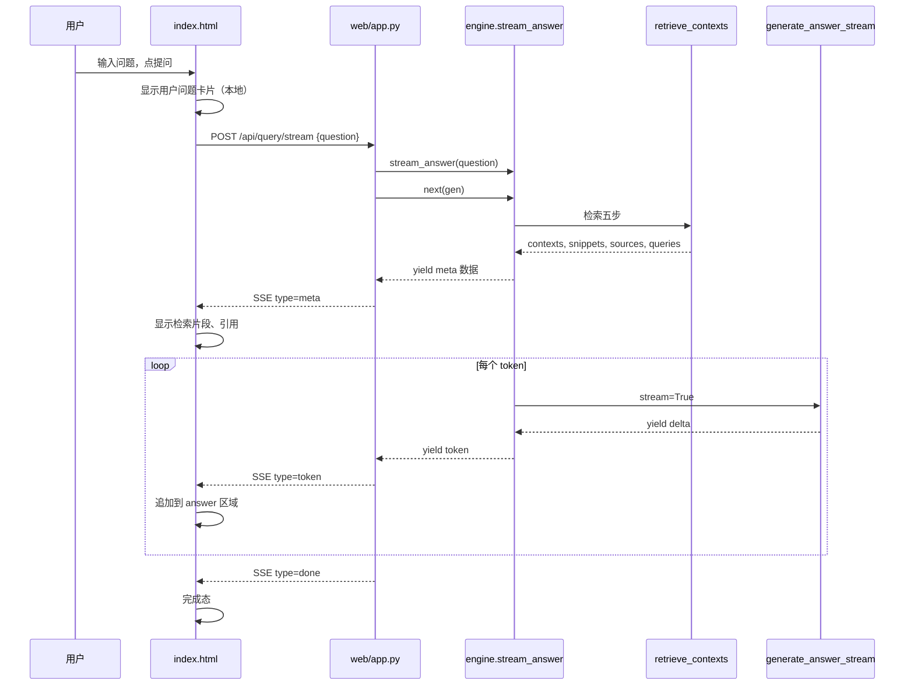
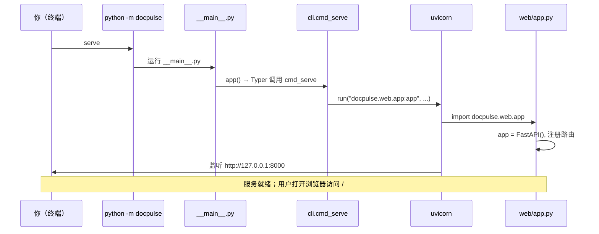

# DocPulse 流程详解

本文档包含三部分：

1. **[完整交互流程](#完整交互流程从用户输入到界面显示)** — 从浏览器提问到 SSE 回显的全链路  
2. **[serve 启动命令链](#serve-启动命令链cli--uvicorn)** — `python -m docpulse serve` 如何跑到 Web 服务  
3. **[检索五步详解](#检索五步流程详解)** — `retrieve_contexts` 内部五步的代码与数据变化  

---

# 完整交互流程：从用户输入到界面显示

## 0. 一张总图

```text
┌─────────────────────────────────────────────────────────────────────────┐
│ 浏览器  index.html                                                       │
│   输入框 #q → 点「提问」→ runQuery() → fetch POST /api/query/stream      │
└───────────────────────────────┬─────────────────────────────────────────┘
                                │ HTTP（JSON 请求 + SSE 流式响应）
                                ▼
┌─────────────────────────────────────────────────────────────────────────┐
│ Web 入口  web/app.py                                                     │
│   api_query_stream → event_gen → get_engine().stream_answer()            │
└───────────────────────────────┬─────────────────────────────────────────┘
                                │
                                ▼
┌─────────────────────────────────────────────────────────────────────────┐
│ RAG 核心  retrieval/engine.py                                            │
│   stream_answer:                                                         │
│     ① retrieve_contexts（检索五步，见下文）                               │
│     ② yield meta → ③ generate_answer_stream（DeepSeek 流式）            │
└───────────────────────────────┬─────────────────────────────────────────┘
                                │ SSE: meta → token×N → done
                                ▼
┌─────────────────────────────────────────────────────────────────────────┐
│ 浏览器  parseSSEStream → 显示检索片段 + 逐字拼接答案                      │
└─────────────────────────────────────────────────────────────────────────┘
```

**启动服务**（项目根目录，详见 [serve 启动命令链](#serve-启动命令链cli--uvicorn)）：

```powershell
.\.venv\Scripts\python.exe -m docpulse serve
# → __main__.py → cli.cmd_serve → uvicorn → docpulse.web.app:app
# → http://127.0.0.1:8000
```

---

## 1. 阶段 A：用户在浏览器里输入（纯前端）

**文件**：`src/docpulse/web/static/index.html`

| 动作 | 代码位置 | 说明 |
|------|----------|------|
| 打字 | `<textarea id="q">` | 浏览器原生控件，**不经过服务器** |
| 提交 | 点「提问」或 Enter | 触发 `runQuery()` |

```javascript
async function runQuery() {
  const question = q.value.trim();        // ① 从输入框取问题
  if (!question) return;

  userQuestion.textContent = question;    // ② 本地立刻显示「用户问题」卡片（不是 SSE）
  answer.textContent = '';                // ③ 清空 AI 回答区
  setStatus('检索中…');

  const res = await fetch('/api/query/stream', {   // ④ 发给后端（见阶段 B）
    method: 'POST',
    headers: { 'Content-Type': 'application/json' },
    body: JSON.stringify({ question }),
  });
  ...
}
```

要点：

- **用户问题显示** = `userQuestion.textContent = question`，一次性赋值，**不是**流式。  
- **真正进入后端** = `fetch` 发出那一刻；URL 为同源的 `/api/query/stream`。

---

## 2. 阶段 B：HTTP 进入 Python（Web 入口）

**文件**：`src/docpulse/web/app.py`

### 2.1 FastAPI 路由匹配

```python
@app.post("/api/query/stream")
def api_query_stream(req: QueryRequest) -> StreamingResponse:
```

FastAPI 自动把请求体 JSON 解析为 `QueryRequest`：

```json
{ "question": "How does dependency injection work in FastAPI?" }
```

→ `req.question` 就是用户问题（还可带 `project`、`use_hybrid` 等，前端默认用服务端默认值）。

### 2.2 创建 SSE 生成器并返回流式响应

```python
def event_gen() -> Iterator[str]:
    gen = get_engine().stream_answer(req.question, ...)   # 接上 RAG（阶段 C）
    first = next(gen)                                      # 触发检索，拿到 meta
    snippets, sources, queries = first
    yield _sse({"type": "meta", ...})                    # 推给浏览器
    for token in gen:
        yield _sse({"type": "token", "content": token})
    yield _sse({"type": "done"})

return StreamingResponse(event_gen(), media_type="text/event-stream", ...)
```

| 概念 | 说明 |
|------|------|
| `get_engine()` | `retrieval/engine.py` 单例 `RAGEngine` |
| `stream_answer` | 生成器：先检索，再流式生成 |
| `next(gen)` | **第一次推进**生成器 → 跑完检索五步 → 得到 `first` |
| `_sse({...})` | 格式化为 `data: {...}\n\n`，符合 SSE 协议 |
| `StreamingResponse` | uvicorn 持续把 `event_gen` 的字符串写给 HTTP 连接 |

**`app.py` 不做检索、不调大模型**，只负责协议转换（Python yield → SSE 文本）。

---

## 3. 阶段 C：RAG 后端（`engine.py` + `generation/`）

**文件**：`src/docpulse/retrieval/engine.py` → `stream_answer`

```python
def stream_answer(self, question, ...):
    contexts, sources, queries, snippets = self.retrieve_contexts(question, ...)
    yield snippets, sources, queries          # ← 对应 app.py 的 first = next(gen)
    for token in generate_answer_stream(question, contexts, self.cfg):
        yield token                           # ← 对应 app.py 的 for token in gen
```

### 3.1 子阶段 C1：检索（`retrieve_contexts`）

详见本文 [检索五步流程详解](#检索五步流程详解)。

| 顺序 | 做什么 | 主要文件 |
|------|--------|----------|
| 1 | 问句扩展 | `query_rewrite.py` |
| 2 | 向量 + BM25 召回 | `embeddings.py`, `chroma_store.py`, `bm25.pkl` |
| 3 | RRF 融合 | `hybrid.py` |
| 4 | Cross-Encoder 重排 | `rerank.py` |
| 5 | Child→Parent，拼上下文 | `engine.py`, `chunks.jsonl` |

**产出**：

- `contexts`：给大模型的文档段落（最多 4 段 Parent）  
- `snippets` / `sources` / `queries`：给前端 meta 展示  

此阶段**不调用 DeepSeek**，可能耗时数秒（加载 embedding / rerank 模型、查 Chroma）。

### 3.2 子阶段 C2：第一次 yield（meta 回 Web）

```python
yield snippets, sources, queries
```

→ `app.py` 收到 `first` → 发 SSE：

```json
{"type": "meta", "snippets": [...], "sources": [...], "queries_used": [...]}
```

### 3.3 子阶段 C3：大模型流式生成

**文件**：`src/docpulse/generation/answer.py`

```python
def generate_answer_stream(question, contexts, cfg):
    system, user, empty = build_chat_messages(question, contexts)
    stream = client.chat.completions.create(..., stream=True)   # DeepSeek API
    for chunk in stream:
        if delta:
            yield delta    # 一小段文字
```

- 读 `.env` 的 `DEEPSEEK_API_KEY`  
- 模型名来自 `config.yaml` 的 `llm.model`  
- 每个 `yield delta` 经 `stream_answer` → `app.py` → SSE `type: token`

---

## 4. 阶段 D：浏览器接收 SSE 并更新界面

**文件**：`index.html` — `parseSSEStream` + `runQuery` 回调

### 4.1 读流

```javascript
await parseSSEStream(res, (ev) => {
  if (ev.type === 'meta') { ... }
  else if (ev.type === 'token') { ... }
  else if (ev.type === 'done') { ... }
  else if (ev.type === 'error') { ... }
});
```

`parseSSEStream`：从 `response.body` 按 `\n\n` 切分，解析 `data: ` 后的 JSON。

### 4.2 各事件如何改 UI

| SSE `type` | 后端何时发出 | 前端做什么 |
|------------|--------------|------------|
| **meta** | 检索结束，`next(gen)` 之后 | `renderSnippets` 填侧栏；`renderSources` 显示引用；状态「已检索 N 段，生成中…」 |
| **token** | 每个 LLM 片段 | `answer.textContent += ev.content`（打字机效果） |
| **done** | 生成结束 | 去掉光标，标题改「AI 回答」，状态「完成」 |
| **error** | 异常 | 显示 `ev.detail` |

---

## 5. 完整时序（按时间）



---

## 6. 与 CLI 的对比（同一套后端）

| 入口 | 文件 | 调用 | 输出 |
|------|------|------|------|
| **Web** | `web/app.py` | `stream_answer` | SSE 流 → 浏览器 |
| **CLI** | `cli.py` | `ask` → `retrieve_contexts` + `generate_answer` | 终端一次性 Markdown |

检索逻辑相同；Web 用流式生成 + SSE，CLI 用非流式一次性打印。

---

## 7. 关键文件速查（全链路）

| 顺序 | 文件 | 作用 |
|------|------|------|
| 1 | `web/static/index.html` | 输入、fetch、解析 SSE、更新 DOM |
| 2 | `web/app.py` | HTTP 路由、`StreamingResponse`、SSE 封装 |
| 3 | `retrieval/engine.py` | `stream_answer`、`retrieve_contexts` |
| 4 | `retrieval/query_rewrite.py` | 步骤 1 问句扩展 |
| 5 | `embeddings.py` + `vectorstore/chroma_store.py` | 步骤 2 向量检索 |
| 6 | `data/state/fastapi/bm25.pkl` | 步骤 2 BM25 |
| 7 | `retrieval/hybrid.py` | 步骤 3 RRF |
| 8 | `retrieval/rerank.py` | 步骤 4 重排 |
| 9 | `data/state/fastapi/chunks.jsonl` | 步骤 5 Parent 全文 |
| 10 | `generation/answer.py` | DeepSeek 流式/非流式生成 |
| 11 | `config.yaml` / `.env` | 检索参数、API Key |

---

## 8. 常见问题

**Q：用户问题是在后端才显示的吗？**  
A：不是。卡片上的「用户问题」是 `fetch` 之前本地 `textContent` 赋值；后端只接收 JSON 里的 `question` 字段。

**Q：`next(gen)` 为什么会让检索跑起来？**  
A：`stream_answer` 是生成器，函数体在第一次 `next` 时才执行到 `retrieve_contexts` 和第一个 `yield`。

**Q：答案为什么是一字一字出来？**  
A：DeepSeek `stream=True` → 多次 `yield token` → 多次 SSE → 前端 `+=` 拼接。

**Q：没跑 `index` 会怎样？**  
A：检索阶段可能 `FileNotFoundError`（缺 BM25），SSE 发 `type: error` 或 HTTP 503。

---

# serve 启动命令链（cli → uvicorn）

本节说明：在项目根目录执行 `python -m docpulse serve` 后，**命令如何一层层进到 `web/app.py` 里的 FastAPI**，以及 uvicorn 如何开始监听 HTTP。

---

## 0. 你敲的那条命令（四段）

```powershell
.\.venv\Scripts\python.exe  -m  docpulse  serve
         ①                 ②    ③       ④
```

| 段 | 含义 |
|----|------|
| **①** | 使用本项目虚拟环境里的 Python（已 `pip install -e .`，能找到 `docpulse` 包） |
| **②** `-m` | 以**模块**方式运行，不是执行某个 `.py` 文件路径 |
| **③** `docpulse` | 包名，对应 `src/docpulse/`（由 `pyproject.toml` 安装注册） |
| **④** `serve` | Typer 子命令：启动 Web，不是 `ingest` / `query` |

等价写法（先激活 venv 后）：

```powershell
.\.venv\Scripts\Activate.ps1
python -m docpulse serve
# 或（安装后生成的入口脚本）
docpulse serve
```

---

## 1. 启动链总图

```text
.\.venv\Scripts\python.exe -m docpulse serve
        │
        ▼
src/docpulse/__main__.py          # python -m docpulse 的入口
        │  from docpulse.cli import app
        │  app()                  # 启动 Typer
        ▼
src/docpulse/cli.py
        │  Typer 解析子命令 serve
        │  调用 cmd_serve()
        ▼
cmd_serve()
        │  import uvicorn
        │  uvicorn.run("docpulse.web.app:app", host, port, reload)
        ▼
uvicorn（ASGI 服务器）
        │  importlib 加载字符串 "docpulse.web.app:app"
        │  取出模块里的变量 app（FastAPI 实例）
        │  绑定 127.0.0.1:8000，等待 HTTP 请求
        ▼
src/docpulse/web/app.py
        app = FastAPI(...)
        @app.get("/")  @app.post("/api/query/stream")  ...
```

**到此为止还没有处理任何用户问题**；只是 Web 服务在监听。用户提问后的 RAG 流程见上文 [完整交互流程](#完整交互流程从用户输入到界面显示)。

---

## 2. 第 1 站：`__main__.py`（`-m docpulse` 进哪里）

**文件**：`src/docpulse/__main__.py`

```python
from docpulse.cli import app

app()
```

Python 规定：执行 `python -m 包名` 时，若包内有 `__main__.py`，就运行它。

- 这里 **不** 直接写 Web 逻辑  
- 只是把 Typer 应用 `app` 跑起来，由 Typer 根据命令行参数分发到 `ingest` / `index` / `query` / **`serve`**

---

## 3. 第 2 站：`cli.py` 里的 Typer 与 `serve` 子命令

**文件**：`src/docpulse/cli.py`

### 3.1 Typer 总入口

```python
app = typer.Typer(
    name="docpulse",
    help="DocPulse-RAG：文档脉冲检索增强系统",
    no_args_is_help=True,
)

@app.command("serve")
def cmd_serve(host=..., port=..., reload=...):
    ...
```

| 对象 | 类型 | 作用 |
|------|------|------|
| `cli.py` 里的 `app` | `typer.Typer()` | 管理所有子命令 |
| `web/app.py` 里的 `app` | `fastapi.FastAPI()` | HTTP 服务（**同名不同物**） |

### 3.2 `cmd_serve` 做什么

```python
@app.command("serve")
def cmd_serve(
    host: str = typer.Option("127.0.0.1", ...),
    port: int = typer.Option(8000, ...),
    reload: bool = typer.Option(False, "--reload", ...),
) -> None:
    import uvicorn
    rprint(f"[green]Web[/green] http://{host}:{port}")
    uvicorn.run(
        "docpulse.web.app:app",
        host=host,
        port=port,
        reload=reload,
    )
```

要点：

- **`cmd_serve` 本身不处理 HTTP**；它只负责调用 uvicorn  
- 打印绿色提示 `http://127.0.0.1:8000` 后，**主线程会阻塞**在 uvicorn 里（直到 Ctrl+C）  
- 可选参数：`--port 8080`、`--host 0.0.0.0`、`--reload`

---

## 4. 第 3 站：`uvicorn.run("docpulse.web.app:app", ...)`

### 4.1 字符串 `"docpulse.web.app:app"` 怎么读

格式：**`模块路径:变量名`**

| 部分 | 对应 |
|------|------|
| `docpulse.web.app` | 文件 `src/docpulse/web/app.py` |
| `:app` | 该文件里的 `app = FastAPI(...)` |

uvicorn 内部（概念上）：

```python
module = importlib.import_module("docpulse.web.app")
asgi_app = module.app    # FastAPI 实例，符合 ASGI 协议
```

### 4.2 为什么不写 `from docpulse.web.app import app` 再传给 uvicorn？

本项目采用**字符串形式**，常见原因：

| 原因 | 说明 |
|------|------|
| **`--reload` 热重载** | 改 `web/app.py` 时，uvicorn 子进程会重新 import 模块 |
| **延迟加载** | 执行 `serve` 时不必立刻加载 FastAPI 及所有依赖链 |
| **惯例** | 与文档命令 `uvicorn docpulse.web.app:app` 一致 |

也可等价手写（本项目未采用）：

```python
from docpulse.web.app import app as fastapi_app
uvicorn.run(fastapi_app, host=host, port=port)
```

### 4.3 uvicorn 启动后内存里有什么

1. 执行 `web/app.py` 顶层代码：`load_dotenv()`、创建 `app = FastAPI(...)`、注册所有 `@app.get` / `@app.post` 路由  
2. 在 `host:port` 上监听 TCP  
3. 收到请求时，按 URL 调用对应路由函数（如 `api_query_stream`）

**注意**：`serve` 时 **不会** 自动执行 `retrieve_contexts` 或下载 rerank 模型；那些在用户 **第一次提问** 时才触发。

---

## 5. 第 4 站：`web/app.py` 里的 FastAPI `app`

**文件**：`src/docpulse/web/app.py`

```python
app = FastAPI(title="DocPulse-RAG", version=__version__)

@app.get("/")
def index(): ...          # 返回 static/index.html

@app.get("/api/health")
def health(): ...

@app.post("/api/query/stream")
def api_query_stream(...): ...   # 浏览器提问走这里
```

浏览器访问 `http://127.0.0.1:8000/` → `index()` → 读到 `static/index.html`。  
页面里 `fetch('/api/query/stream')` → 同源 POST → `api_query_stream()`。

---

## 6. 与 `pyproject.toml` 的关系

```toml
[project.scripts]
docpulse = "docpulse.cli:app"

[project]
name = "docpulse"
...

[tool.hatch.build]
sources = ["src"]
```

| 配置 | 作用 |
|------|------|
| `pip install -e .` | 把 `src/docpulse` 装进 venv，且 `import docpulse` 可用 |
| `[project.scripts]` | 在 `Scripts/` 下生成 `docpulse.exe`，内部仍调用 `cli:app` |
| `python -m docpulse` | 走 `__main__.py`，效果与 `docpulse` 命令类似 |

**没有** `pip install -e .` 时，`-m docpulse` 会报 `No module named docpulse`。

---

## 7. 启动链时序图



---

## 8. 常用变体命令

```powershell
# 默认本机 8000 端口
.\.venv\Scripts\python.exe -m docpulse serve

# 改端口
.\.venv\Scripts\python.exe -m docpulse serve --port 8080

# 开发：改 web/app.py 或 engine.py 后自动重启（慎用：重载会重新加载大模型）
.\.venv\Scripts\python.exe -m docpulse serve --reload

# 局域网可访问（注意安全）
.\.venv\Scripts\python.exe -m docpulse serve --host 0.0.0.0

# 跳过 Typer，直接 uvicorn（与 serve 核心相同）
.\.venv\Scripts\uvicorn.exe docpulse.web.app:app --host 127.0.0.1 --port 8000
```

---

## 9. 启动链 vs 问答链（别混）

| 阶段 | 何时发生 | 涉及文件 |
|------|----------|----------|
| **启动链** | 执行 `serve` 一次 | `__main__.py` → `cli.py` → uvicorn → `web/app.py` 注册路由 |
| **问答链** | 每次用户点「提问」 | `index.html` → `api_query_stream` → `stream_answer` → … |

启动链结束后，进程**一直挂着**等 HTTP；问答链在每次 `POST /api/query/stream` 时执行。

---

## 10. 启动链常见问题

**Q：`serve` 和 `query` 有什么区别？**  
A：`serve` 启动长期运行的 Web 服务；`query` 在终端问一句答一句就退出，走 `cli.cmd_query` → `engine.ask()`。

**Q：为什么必须在项目根目录？**  
A：`config.yaml`、`data/`、`.env` 相对路径默认以**当前工作目录**为项目根；`project_root()` 也会从 cwd 找 `config.yaml`。在别的目录启动可能找不到配置或数据。

**Q：关掉终端里的 serve 会怎样？**  
A：uvicorn 进程结束，浏览器无法再访问 `http://127.0.0.1:8000`。

**Q：第一次打开网页会很慢吗？**  
A：打开 `/` 很快；**第一次提问**可能较慢（加载 embedding / rerank、读 Chroma），与 `serve` 启动无关。

---

# 检索五步流程详解

下面按 **检索 5 步**，从「输入什么 → 代码怎么写 → 输出什么」讲清楚。建议边看边打开对应文件。

**配置默认值**（`config.yaml`）：

```text
dense_k=50, sparse_k=50, rrf_k=60, rerank_k=8, final_parent_n=4
rule_expansions=2
```

**贯穿全文的例子**（用户问题）：

```text
How does dependency injection work in FastAPI?
```

每一步结束时，数据长什么样也会写出来。

---

## 总览：五步在改什么？

```text
question（一句人话）
    ↓ 步骤1
queries（1～3 条问句）
    ↓ 步骤2
多条 chunk_id 排名列表（dense + sparse × 每条 query）
    ↓ 步骤3
约 60 个候选 child_id（RRF 分排序）
    ↓ 步骤4
约 8 个最相关 child_id（重排）
    ↓ 步骤5
最多 4 段 Parent 全文 → contexts + snippets/sources
```

---

# 步骤 1：问句扩展（Multi-Query）

**调用位置**（`engine.py`）：

```python
queries = (
    rule_expand_queries(question, self.cfg)
    if use_rewrite
    else [question]
)
```

**实现文件**：`retrieval/query_rewrite.py`

---

## 1.1 为什么要这一步？

- 用户一句问法，和文档里的写法可能不一致（`FastAPI` vs `Fast API`）。
- 多生成几条「等价问句」，后面每条都单独检索，**提高召回**（漏检更少）。
- 当前是**规则**，不是 LLM（M4 才计划 LLM 扩展）。

---

## 1.2 代码怎么一点点写的？

### ① 三条正则（从问题里「抠」词）

```python
BACKTICK_RE = re.compile(r"`([^`]+)`")
CAMEL_RE = re.compile(r"\b[A-Z][a-zA-Z0-9]+\b")
SNAKE_RE = re.compile(r"\b[a-z]+_[a-z0-9_]+\b")
```

| 正则 | 匹配例子 |
|------|----------|
| 反引号 | `` `APIRouter` `` → `APIRouter` |
| CamelCase | `FastAPI`, `BackgroundTasks` |
| snake_case | `background_tasks` |

### ② 去重辅助函数 `add`

```python
extras: List[str] = []
seen = {question.strip().lower()}

def add(q: str) -> None:
    q = q.strip()
    if not q or q.lower() in seen:
        return
    seen.add(q.lower())
    extras.append(q)
```

- `seen`：小写比较，避免 `FastAPI` 和 `fastapi` 重复。
- 只有通过 `add` 的字符串才进 `extras`。

### ③ 从问题里收集扩展候选

```python
for m in BACKTICK_RE.findall(question):
    add(m)

for m in CAMEL_RE.findall(question):
    add(m)
    add(re.sub(r"([a-z])([A-Z])", r"\1 \2", m))   # FastAPI → Fast API

for m in SNAKE_RE.findall(question):
    add(m.replace("_", " "))

words = [w for w in re.findall(r"[A-Za-z]{3,}", question)]
if len(words) >= 2:
    add(" ".join(words[:6]))
```

对你例子可能抽到：

- `FastAPI`
- `Fast API`（拆词，帮 BM25）
- `How does dependency injection work`（关键词串，最多 6 个词）

### ④ 拼最终结果

```python
queries = [question]
queries.extend(extras[:n])   # n = rule_expansions，默认 2
return queries
```

**输出形状**（概念上）：

```python
queries = [
    "How does dependency injection work in FastAPI?",  # 原问，必有
    "FastAPI",                                          # 扩展1（举例）
    "Fast API",                                         # 扩展2（举例）
]
# 最多 1 + 2 = 3 条
```

`--no-rewrite` 时：`queries = [question]`，只有 1 条。

---

# 步骤 2：多路召回（Dense + Sparse）

**调用位置**（`engine.py`）：

```python
for q in queries:
    if use_hybrid:
        dense_lists.append([cid for cid, _ in self._dense_search(q, project, rc.dense_k)])
        sparse_lists.append([cid for cid, _ in self._sparse_search(q, project, rc.sparse_k)])
```

对 **每一条** `q` 各做一路向量、一路 BM25，得到两份 **有序 id 列表**（只要 id，分数后面 RRF 不用）。

假设 3 条 query、混合检索 → 最多 **6 份列表**：

```python
dense_lists = [ list_50_ids_q0, list_50_ids_q1, list_50_ids_q2 ]
sparse_lists = [ list_50_ids_q0, list_50_ids_q1, list_50_ids_q2 ]
```

---

## 2A 稠密检索 `_dense_search`

**代码**（`engine.py`）：

```python
def _dense_search(self, query: str, project: str, limit: int) -> List[Tuple[str, float]]:
    vec = embed_texts([query])[0]
    return get_vector_store().query_dense(vec, project, limit)
```

### 第 1 小步：`embed_texts`（`embeddings.py`）

```python
# 问句 → 384 维向量（bge-small-en 举例）
vec = [0.12, -0.03, ...]
```

- 模型：`BAAI/bge-small-en-v1.5`（`config.yaml`）
- `normalize_embeddings=True`：方便用余弦相似度

### 第 2 小步：`query_dense`（`chroma_store.py`）

```python
res = self.collection.query(
    query_embeddings=[query_vector],
    n_results=limit,                    # 50
    where={
        "$and": [
            {"project": {"$eq": project}},
            {"level": {"$eq": "child"}},    # 只查 child
            {"is_active": {"$eq": True}},
        ]
    },
    ...
)
return [(cid, 1.0 - float(d)) for cid, d in zip(ids, dists)]
```

- 数据来自离线 `index` 写入的 `data/state/chroma/`
- 返回：50 个 `(chunk_id, 相似度)`，**按相似度从高到低**
- 语义检索：即使没出现原词，意思接近也能查到

**本步输出**（单条 query）：

```python
[
  ("abc123...", 0.82),
  ("def456...", 0.79),
  ...  # 共 50 个
]
```

`engine` 里 `[cid for cid, _ in ...]` 只保留 id 列表。

---

## 2B 稀疏检索 `_sparse_search`

**代码**（`engine.py`）：

```python
def _sparse_search(self, query: str, project: str, limit: int) -> List[Tuple[str, float]]:
    chunk_ids, bm25 = self._load_bm25(project)
    tokens = [t.lower() for t in TOKEN_RE.findall(query)]
    if not tokens:
        return []
    scores = bm25.get_scores(tokens)
    ranked = sorted(zip(chunk_ids, scores), key=..., reverse=True)[:limit]
    return [(cid, float(s)) for cid, s in ranked if s > 0]
```

### 第 1 小步：加载 `bm25.pkl`

- 路径：`data/state/fastapi/bm25.pkl`
- 内容：`chunk_ids`（与语料行一一对应）+ `BM25Okapi` 对象
- 建索引时：`indexer.py` 对每个 child 文本分词后 `BM25Okapi(corpus_tokens)`

### 第 2 小步：问句分词

```python
# "How does dependency injection work in FastAPI?"
tokens = ["how", "does", "dependency", "injection", "work", "in", "fastapi"]
```

与建索引时用同一套 `TOKEN_RE`，保证词表一致。

### 第 3 小步：`get_scores`

- 对 **每一个 child** 算 BM25 分
- 按分排序，取 top 50，`score > 0` 才保留

**擅长**：`APIRouter`、`Depends` 这类**精确词**；和向量路互补。

---

## 步骤 2 小结

| 路径 | 文件 | 读的数据 | 输出 |
|------|------|----------|------|
| Dense | embeddings + chroma | chroma 向量库 | 每 query 50 个 child_id |
| Sparse | bm25.pkl | 内存 BM25 | 每 query 50 个 child_id |

---

# 步骤 3：RRF 融合

**调用位置**：

```python
fused = rrf_fuse(
    dense_lists + (sparse_lists if use_hybrid else []),
    rrf_k=rc.rrf_k,
    top_n=rc.rrf_k,
)
candidate_ids = [cid for cid, _ in fused]
```

**实现文件**：`retrieval/hybrid.py`（全文约 40 行）

---

## 3.1 为什么要 RRF？

- 向量分：0～1 左右；BM25 分：可能是 0～20。**量纲不同，不能直接相加。**
- RRF 只看 **排名**：第几名，不关心原始分数。

---

## 3.2 代码怎么写？

```python
scores: Dict[str, float] = {}
for ranking in ranked_lists:           # 遍历 6 份列表（举例）
    for rank, doc_id in enumerate(ranking):  # rank = 0,1,2,...
        scores[doc_id] = scores.get(doc_id, 0.0) + 1.0 / (rrf_k + rank + 1)
ordered = sorted(scores.items(), key=lambda x: -x[1])
return ordered[:top_n]
```

**公式**：每个 chunk 的 RRF 分 = 它在每条列表里的贡献之和

```
score(d) += 1 / (k + rank(d) + 1)
```

`k=60`（`rrf_k`）。

**数值例子**：某 chunk 在一路 dense 排 **第 0** 名：

```
1/(60+0+1) ≈ 0.0164
```

若在另一路 BM25 排 **第 2** 名：

```
1/(60+2+1) ≈ 0.0159
```

合计 ≈ 0.0323。在 **多路都靠前** 的 chunk 会累加更高 → 排更前。

**输出**：

```python
fused = [
  ("chunk_aaa", 0.045),
  ("chunk_bbb", 0.038),
  ...  # 最多 60 个
]
candidate_ids = ["chunk_aaa", "chunk_bbb", ...]
```

此时还是 **child 小块 id**，且顺序是 RRF 综合分，不是最终给 LLM 的顺序。

---

## 步骤 3 之后：取正文（为步骤 4 准备）

```python
payloads = self._payload_map(candidate_ids)
pairs: List[Tuple[str, str]] = []
for cid in candidate_ids:
    p = payloads.get(cid)
    if p:
        pairs.append((cid, p.get("text", "")))
```

- `_payload_map` → Chroma `get`：拿每个 child 的 **短文** + `parent_id`、`file_path` 等
- `pairs`：约 60 个 `(chunk_id, child正文)`，供重排模型读

---

# 步骤 4：Cross-Encoder 重排

**调用位置**：

```python
if use_rerank and pairs:
    reranked = rerank_pairs(question, pairs, top_k=rc.rerank_k)
    top_child_ids = [cid for cid, _ in reranked]
    score_map = {cid: sc for cid, sc in reranked}
```

注意：这里用 **用户原问 `question`**，不用扩展后的 `queries`。

**实现文件**：`retrieval/rerank.py`

---

## 4.1 和步骤 2 向量检索的区别

| | 步骤 2 Dense（Bi-Encoder） | 步骤 4 Rerank（Cross-Encoder） |
|---|---------------------------|-------------------------------|
| 编码 | 问句、文档**分开**编码再比 | 问句+文档**拼一起**进模型 |
| 速度 | 快，适合上万条 | 慢，只适合几十条 |
| 精度 | 召回用 | 精排用 |

流程：**先粗召回 60 → 再精排留 8**。

---

## 4.2 代码怎么写？

```python
model = get_reranker()   # bge-reranker-base，首次较慢
inputs = [[query, text] for _, text in pairs]
scores = model.predict(inputs)   # 每个 pair 一个相关分
ranked = sorted(zip([cid for cid, _ in pairs], scores), key=..., reverse=True)
return ranked[:top_k]   # top_k = 8
```

**输入例子**（概念）：

```python
inputs = [
  ["How does dependency injection...", "Depends() is used to declare..."],
  ["How does dependency injection...", "FastAPI supports dependency injection..."],
  ...  # 约 60 对
]
```

**输出**：

```python
top_child_ids = ["chunk_x", "chunk_y", ...]  # 8 个，最相关在前
score_map = {"chunk_x": 0.91, "chunk_y": 0.87, ...}
```

`--no-rerank` 时：直接 `candidate_ids[:8]`，用 RRF 分当 score。

---

# 步骤 5：Child → Parent，拼上下文

**代码**（主要在 `engine.py` 207–241 行）：

```python
parents = self._parents_for(project)
seen_parents: set = set()
...
for cid in top_child_ids:          # 按重排顺序遍历 8 个 child
    p = payloads.get(cid, {})
    pid = p.get("parent_id", "")
    if pid in seen_parents:
        continue                    # 同一章节只取一次
    seen_parents.add(pid)
    parent = parents.get(pid)
    block = parent.text if parent else p.get("text", "")
    ...
    context_blocks.append(f"[{fp}] {hp}\n{block}")
    ...
    if len(context_blocks) >= rc.final_parent_n:   # 4
        break
```

---

## 5.1 为什么要 Child 检索、Parent 给 LLM？

入库时（`chunker`）：

- **Child**：约 400 字，短、好匹配 → 写入 Chroma / BM25
- **Parent**：整节 `##` 章节，可能 1500 字 → 只在 `chunks.jsonl`，不进向量库

检索命中 **child**，回答需要 **完整章节** → 用 `parent_id` 换回 Parent 全文。

---

## 5.2 `_parents_for` 怎么加载 Parent？

```python
def _parents_for(self, project: str) -> Dict[str, ChunkRecord]:
    if project not in self._parents_cache:
        all_chunks = load_chunks(chunks_path(self.state_root, project))
        parents = {}
        for c in all_chunks:
            if c.level == "parent":
                parents[c.parent_id] = c
                parents[c.chunk_id] = c
        self._parents_cache[project] = parents
    return self._parents_cache[project]
```

- 读 `data/state/fastapi/chunks.jsonl`
- 字典：`parent_id → ChunkRecord`（含长文本 `text`）
- 进程内缓存，避免每次问答都读 5000+ 行

---

## 5.3 循环在做什么？

按 **重排后的 8 个 child** 顺序走：

1. 从 `payloads[cid]` 拿 `parent_id`、`file_path`、`heading_path`
2. 若这个 `parent_id` 已经处理过 → `continue`（两个 child 同属一章只留一次）
3. `parents[pid].text` → 整节 Parent  markdown
4. 拼进 `context_blocks`：

```text
[docs/en/docs/tutorial/dependencies.md] Tutorial > Dependencies
## Dependencies
...(整节正文)...
```

5. 同时填 `sources`、`snippets`（给 Web 展示引用和侧栏）
6. 满 **4** 段 Parent → `break`

**最终返回**（`retrieve_contexts` 结束）：

```python
context_blocks   # 最多 4 个 str → 给 generate_answer_stream
sources          # 引用列表
queries          # 步骤1 的问句列表
snippets         # 带正文的片段（和 contexts 类似，给 UI）
```

---

# 五步串联数据表（一张表记牢）

| 步 | 文件 | 输入 | 输出 |
|----|------|------|------|
| 1 | `query_rewrite.py` | `question` | `queries`（1～3 条） |
| 2 | `engine` + `embeddings` + `chroma` + `bm25` | 每条 `q` | `dense_lists` + `sparse_lists` |
| 3 | `hybrid.py` | 多份 id 排名 | ~60 个 `candidate_ids` |
| 4 | `rerank.py` + Chroma payloads | `question` + ~60 段短文 | 8 个 `top_child_ids` |
| 5 | `engine` + `chunks.jsonl` | 8 个 child + parents 表 | 4 段 `context_blocks` |

---

# 建议学习顺序（动手）

1. **步骤 1**：在 `query_rewrite.py` 末尾加 `print(rule_expand_queries("你的问题"))` 看扩展结果。
2. **步骤 2**：只读 `_dense_search` / `_sparse_search`，对照 `chroma` 和 `bm25.pkl`。
3. **步骤 3**：手算 2 条列表、2 个 chunk 的 RRF 分（用 hybrid 里公式）。
4. **步骤 4**：理解 `pairs` 是什么，再看 `rerank_pairs`。
5. **步骤 5**：在 `chunks.jsonl` 找一条 child，看它的 `parent_id`，再在文件里搜对应 parent 的 `text`。

---

# 和后面生成的衔接

```python
contexts, sources, queries, snippets = self.retrieve_contexts(...)
# contexts = context_blocks，上面 5 步的产物

yield snippets, sources, queries          # Web meta
for token in generate_answer_stream(question, contexts, ...):
    yield token                           # 步骤 6：LLM，不算检索五步
```

---

# 模块分工速查

| 步骤 | 在 `engine.py` 里写什么 | 真正干活的代码在哪 |
|------|-------------------------|-------------------|
| **1 问句扩展** | `rule_expand_queries(...)` 一行调用 | `retrieval/query_rewrite.py` |
| **2 多路召回** | `self._dense_search` / `self._sparse_search` | 方法写在 `engine.py`，内部再调 `embeddings.py`、`chroma_store.py`、`bm25.pkl` |
| **3 RRF 融合** | `rrf_fuse(...)` 一行调用 | `retrieval/hybrid.py` |
| **4 重排** | `rerank_pairs(...)` 一行调用 | `retrieval/rerank.py` |
| **5 Parent 上下文** | `for cid in top_child_ids:` 循环 | `_parents_for()` 在 engine，内部 `load_chunks()` → `ingest/state.py` |

`RAGEngine`（`engine.py`）= 对外统一入口（`ask` / `stream_answer` / `retrieve_contexts`），把各步串成一条 RAG 检索链。
