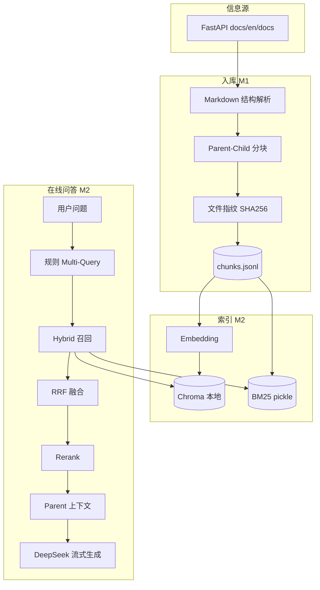

# DocPulse-RAG 项目方案及使用方法

> 文档脉冲检索增强系统 — 基于开源项目官方文档的进阶 RAG 工程实践

---

## 一、项目概述

| 项 | 说明 |
|----|------|
| **项目名称** | DocPulse-RAG（DocPulse） |
| **定位** | 完整 RAG 链路：入库 → 混合检索 → 重排 → 流式生成 →（规划）评测与增量更新 |
| **语言** | Python 3.9+ |
| **信息源** | FastAPI 官方英文文档 `docs/en/docs/**/*.md` |
| **边界** | 不做大规模爬虫、多租户、生产级权限 |

**命名含义**

- **Doc**：开源项目官方文档（Git `docs/`）
- **Pulse**：指纹 + 增量更新，知识库随文档变更持续「跳动」

---

## 二、当前实现进度

| 阶段 | 状态 | 说明 |
|------|------|------|
| **M1** | ✅ 已完成 | Git/本地同步、结构感知分块、指纹、`chunks.jsonl` |
| **M2** | ✅ 已完成 | Chroma 本地向量 + BM25 + Hybrid + Rerank + CLI/Web 流式问答 + DeepSeek |
| **M3** | 待做 | Chroma/BM25 指纹驱动增量 upsert/delete |
| **M4** | 待做 | LLM Multi-Query（当前为规则扩展） |
| **M5** | 待做 | `golden.jsonl` + Recall@K + 引用命中率 + 消融 |

---

## 三、技术栈（已实现）

| 模块 | 选型 |
|------|------|
| 编排 | 自研薄封装 `src/docpulse/`（无 LlamaIndex） |
| 向量库 | **ChromaDB** 本地持久化（`data/state/chroma`，**无需 Docker**） |
| BM25 | `rank_bm25` + `data/state/<project>/bm25.pkl` |
| Embedding | `BAAI/bge-small-en-v1.5`（`config.yaml` 可改） |
| Rerank | `BAAI/bge-reranker-base`（首次 query 约 1.1GB 下载） |
| LLM | **DeepSeek API**（OpenAI 兼容，`DEEPSEEK_API_KEY`） |
| Web | FastAPI + 静态页（流式 SSE、检索片段面板） |
| 解析/分块 | 标题树 + Parent-Child（`##` / `###`） |

---

## 四、总体架构



**检索参数**（`config.yaml` → `retrieval`）：

```text
dense_k=50, sparse_k=50, rrf_k=60, rerank_k=8, final_parent_n=4
```

---

## 五、分块与元数据

| 层级 | 策略 |
|------|------|
| **Parent** | 每个 `##` / `###` 章节，上限约 1500 字 → 送 LLM |
| **Child** | 段落/代码块边界，约 400 字、50 字 overlap → 检索索引 |
| **元数据** | `doc_id, chunk_id, parent_id, file_path, heading_path, ...` |

---

## 六、环境准备

### 6.1 依赖

- Python 3.9+
- Git（拉取文档；也可用 ZIP，见 `docs/入库指南.md`）
- DeepSeek API Key
- **不需要 Docker**

### 6.2 安装

```powershell
# 在仓库根目录执行
python -m venv .venv

# PowerShell 若无法执行 Activate.ps1，可直接用：
.\.venv\Scripts\python.exe -m pip install -e .

copy .env.example .env
# 在本机编辑 .env，填入 DEEPSEEK_API_KEY
# 编辑 config.yaml 中 llm.model 为控制台实际模型名
```

---

## 七、命令行使用方法

所有命令均在**项目根目录**执行。推荐统一前缀：

```powershell
$py = ".\.venv\Scripts\python.exe"
```

也可将 `.\.venv\Scripts\python.exe` 替换为已激活虚拟环境后的 `python`。

---

### 7.1 `ingest` — 文档入库（M1）

解析 Markdown，生成 Parent-Child 块，写入 `data/state/fastapi/chunks.jsonl` 与指纹文件。

```powershell
# 首次：尝试 clone FastAPI 并解析（需联网）
$py -m docpulse ingest

# 已 clone 后更新仓库并增量解析
$py -m docpulse ingest --pull

# 跳过 git，使用已有 data/repos/fastapi（ZIP 解压后常用）
$py -m docpulse ingest --no-sync

# 删除非 git 目录后强制重新 clone 完整文档
$py -m docpulse ingest --force-clone

# 忽略指纹，全量重新解析所有 md
$py -m docpulse ingest --full

# 仅处理指定项目（与 config.yaml 中 name 一致）
$py -m docpulse ingest -p fastapi

# 指定配置文件
$py -m docpulse ingest --config path\to\config.yaml
```

| 选项 | 说明 |
|------|------|
| `--pull` | 对已存在 git 仓库执行 pull |
| `--no-sync` | 不 clone/pull，仅用本地 `data/repos/` |
| `--force-clone` | 删掉非 git 的 repo 目录后重新 clone |
| `--full` | 全量解析，不跳过未变文件 |
| `-p, --project` | 只处理某一项目 |

**成功标志**：终端表格 `files` 为几十～上百（非 2）；`data/state/fastapi/chunks.jsonl` 行数达数千。

---

### 7.2 `index` — 向量与 BM25 索引（M2）

将 **child** 块向量化写入 Chroma，并构建 BM25。

```powershell
# 常规索引（按 project 删除旧向量后 upsert）
$py -m docpulse index

# 重建整个 Chroma collection 后写入
$py -m docpulse index --recreate

# 仅索引指定项目
$py -m docpulse index -p fastapi
```

| 选项 | 说明 |
|------|------|
| `--recreate` | 删除并重建 collection（向量维度变化时需用） |
| `-p, --project` | 指定项目名 |

**说明**：首次会下载 Embedding 模型；首次 **query** 还会下载 Rerank 模型（约 1.1GB）。索引结果目录：

- `data/state/chroma/` — Chroma 持久化
- `data/state/fastapi/bm25.pkl` — BM25

---

### 7.3 `query` — 命令行问答（M2）

混合检索 + Rerank + DeepSeek 生成（中文回答 + 引用）。

```powershell
$py -m docpulse query "How do I use Depends for dependency injection in FastAPI?"

# 中文问题也可（检索偏英文文档，效果视问法而定）
$py -m docpulse query "FastAPI 里依赖注入怎么写？"

# 消融：关闭部分能力
$py -m docpulse query "How to use BackgroundTasks?" --no-hybrid    # 仅向量
$py -m docpulse query "How to use BackgroundTasks?" --no-rerank   # 无精排（跳过大模型下载）
$py -m docpulse query "How to use BackgroundTasks?" --no-rewrite # 无规则扩展问句

# 指定项目
$py -m docpulse query "..." -p fastapi
```

| 选项 | 说明 |
|------|------|
| `--no-hybrid` | 关闭 BM25，仅稠密检索 |
| `--no-rerank` | 关闭 Cross-Encoder 精排 |
| `--no-rewrite` | 关闭规则 Multi-Query |
| `-p, --project` | 项目名，默认 `fastapi` |

测试问题见根目录 **`测试问题.md`**（50 条英文示例）。

---

### 7.4 `serve` — Web 界面（M2）

```powershell
$py -m docpulse serve

# 自定义端口
$py -m docpulse serve --port 8080

# 开发热重载
$py -m docpulse serve --reload
```

浏览器打开：**http://127.0.0.1:8000**

- 流式回答（SSE）
- **查看检索片段**：展开本次送入模型的 Parent 正文
- 底部显示引用来源与检索扩展问句

---

### 7.5 命令一览

| 命令 | 作用 |
|------|------|
| `python -m docpulse ingest` | 文档入库、分块、指纹 |
| `python -m docpulse index` | Chroma + BM25 索引 |
| `python -m docpulse query "..."` | 命令行 RAG 问答 |
| `python -m docpulse serve` | 启动 Web 服务 |

查看帮助：

```powershell
$py -m docpulse --help
$py -m docpulse ingest --help
```

---

## 八、推荐使用流程（从零到问答）

```powershell
命令行指令是这个  下次直接使用  复制下面这个就行
.\.venv\Scripts\python.exe -m docpulse serve
Web界面浏览器打开：**http://127.0.0.1:8000**

# 1. 安装与 API
$py -m pip install -e .
copy .env.example .env
# 填写 DEEPSEEK_API_KEY

# 2. 入库（GitHub 不通见 docs/入库指南.md）
$py -m docpulse ingest --no-sync
# 或：$py -m docpulse ingest --force-clone

# 3. 建索引
$py -m docpulse index

# 4. 命令行试答
$py -m docpulse query "How does dependency injection work in FastAPI?"

# 5. Web
$py -m docpulse serve
```

---

## 九、目录结构

```text
3DocPulse-RAG/
├── 项目方案及使用方法.md      # 本文档
├── 测试问题.md                # 50 条英文测试问句
├── README.md
├── config.yaml
├── .env.example
├── pyproject.toml
├── docs/
│   └── 入库指南.md            # GitHub 连不上时的入库说明
├── data/
│   ├── repos/fastapi/         # 官方文档 clone（gitignore）
│   └── state/
│       ├── fastapi/
│       │   ├── chunks.jsonl
│       │   ├── bm25.pkl
│       │   └── file_fingerprints.json
│       └── chroma/            # 本地向量库
├── src/docpulse/
│   ├── ingest/                # git_sync, parser, chunker, indexer
│   ├── retrieval/             # hybrid, rerank, query_rewrite, engine
│   ├── generation/            # DeepSeek 生成
│   ├── vectorstore/           # Chroma 封装
│   └── web/                   # FastAPI + static/index.html
└── eval/golden.jsonl          # 评测集（M5）
```

---

## 十、配置说明（`config.yaml` 摘要）

```yaml
projects:
  - name: fastapi
    repo: https://github.com/tiangolo/fastapi.git
    docs_glob: "docs/en/docs/**/*.md"

vector_store:
  persist_dir: data/state/chroma
  collection: docpulse_chunks

embedding:
  model: BAAI/bge-small-en-v1.5

rerank:
  model: BAAI/bge-reranker-base

llm:
  base_url: https://api.deepseek.com
  model: deepseek-chat   # 以 DeepSeek 控制台为准
```

---

## 十一、后续里程碑（规划）

| 阶段 | 内容 |
|------|------|
| M3 | ingest 后自动/增量更新 Chroma 与 BM25 |
| M4 | LLM 查询改写；中文问可选 query 翻译 |
| M5 | `eval` 命令、Recall@K、消融 CSV |

**消融设计（M5）**

| 配置 | 向量 | BM25 | Rerank | Multi-Query |
|------|:----:|:----:|:------:|:-----------:|
| baseline | ✓ | | | |
| +hybrid | ✓ | ✓ | | |
| +rerank | ✓ | ✓ | ✓ | |
| full | ✓ | ✓ | ✓ | ✓ |

---

## 十二、常见问题

| 现象 | 处理 |
|------|------|
| GitHub clone 失败 | 见 `docs/入库指南.md`，ZIP + `ingest --no-sync` |
| `未设置 DEEPSEEK_API_KEY` | 根目录 `.env` 配置密钥 |
| 首次 query 下载 1.1GB | Rerank 模型缓存，或用 `--no-rerank` |
| 检索结果差（中文问） | 尽量中英混合关键词；或换多语言 embedding 后重新 index |
| 回答与文档无关 | 确认已 `index`；换英文问句对比 |
| PowerShell 无法 Activate | 直接用 `.\.venv\Scripts\python.exe -m docpulse ...` |

---

## 十三、与简单 RAG 的对比

| 维度 | 简单 RAG | DocPulse-RAG |
|------|----------|--------------|
| 检索 | 单路向量 | Hybrid（Chroma + BM25）+ RRF + Rerank |
| 分块 | 固定长度 | 结构感知 + Parent-Child |
| 向量库 | 常需服务/Docker | Chroma 本地文件 |
| 更新 | 全量重建为主 | 指纹跳过 +（规划）增量索引 |
| 交互 | 一次性返回 | Web 流式 + 检索片段可视 |
| 评测 | 主观 | （规划）Recall@K + 消融 |

---

## 十四、总结

**DocPulse-RAG** 以 FastAPI 官方英文文档为知识源，经结构感知分块与本地 Chroma/BM25 混合检索、Cross-Encoder 精排后，由 DeepSeek 流式生成中文回答并标注文档来源。当前可通过 **`ingest` → `index` → `query` / `serve`** 完成端到端体验；增量索引与系统化评测将在 M3～M5 补齐。
